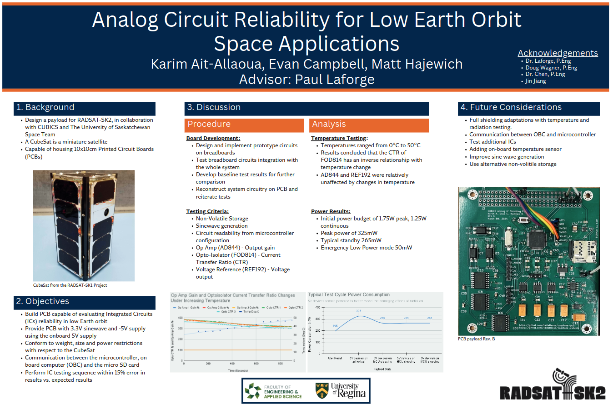
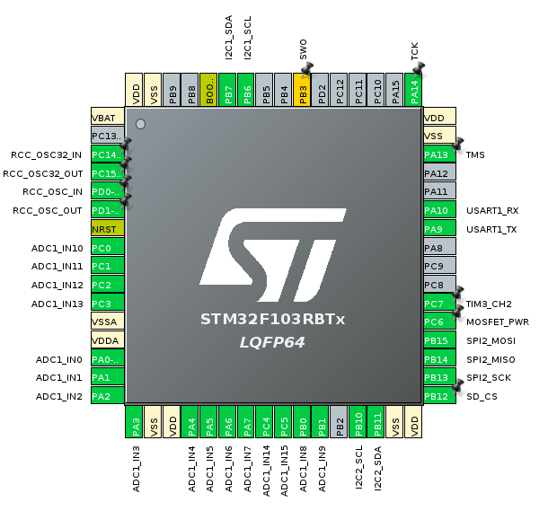

# Analog Circuit Reliability for Low Earth Orbit Space Applications

In collaboration with the University of Saskatchewan, we are contributing a payload board
for the CubeSats Initiative in Canada for STEM (CUBICS). A CubeSat is a low cost, small
and approachable design for students “to engage in an end-to-end space mission
adapted to their needs and their level of comfort, expertise and readiness” (asc-csa.
gc.ca). Our payload studies the effects of space radiation on commonly used surface
mount analog Integrated Circuits (IC’s) in Low Earth Orbit (LEO). We compare different
shielding to see which provides a better effectiveness to weight ratio.



## PCB

Available [here](https://github.com/kaitallaoua/capstone-pcb)

## Setup
Get it [here](https://www.st.com/en/development-tools/stm32cubeide.html#get-software).

This project uses STM32CubeIde `Version: 1.13.1` and its code generator STM32CubeMX `Version: 6.9.1-RC1 Build: 20230719-1849 (UTC)`

## Workflow

I was the only software person for this project, so I didnt bother with PR's and other typical and proper version control methods.

I highly recommend new contributers to review how the cube ide works and how to work with (not against) the code generator. Since the code generator will overwrite your changes if they are not in the proper place, it can be frustrating untill you are familiar with it. 

## TODO

There is alot. Initally freeRTOS was used as it was recommended but I have removed it seeing as it provided no benefit. Espcially given that future contributers are likely not familiar with it, going towards a state machine seems best. However adding freeRTOS back is very easy.

The micro sd card can be flakey at times, not sure why. If you see `f_mount error (3)` that is what I am talking about, though this can also mean the sd card is not inserted into the payload. There is a known issue that filenames must be kept very short or else the middleware will not make the file.

- Review if micro sd card should be kept, somehow ensure its reliability over many insertions.
- Review if freeRTOS is actually needed
- Get I2C (interrupt based) working with OBC (start with another nucleom then go to PocketBeagle)
- General cleanup
- Right now the code is written for the demo going through the various states, write a proper state machine
- Document, develop the I2C comm protocol with OBC, what actual messages will be sent

## MCU GPIO Usage



## Micro sd card errors

For your convience, here are the error codes:
```
	FR_OK = 0,				/* (0) Succeeded */
	FR_DISK_ERR,			/* (1) A hard error occurred in the low level disk I/O layer */
	FR_INT_ERR,				/* (2) Assertion failed */
	FR_NOT_READY,			/* (3) The physical drive cannot work */
	FR_NO_FILE,				/* (4) Could not find the file */
	FR_NO_PATH,				/* (5) Could not find the path */
	FR_INVALID_NAME,		/* (6) The path name format is invalid */
	FR_DENIED,				/* (7) Access denied due to prohibited access or directory full */
	FR_EXIST,				/* (8) Access denied due to prohibited access */
	FR_INVALID_OBJECT,		/* (9) The file/directory object is invalid */
	FR_WRITE_PROTECTED,		/* (10) The physical drive is write protected */
	FR_INVALID_DRIVE,		/* (11) The logical drive number is invalid */
	FR_NOT_ENABLED,			/* (12) The volume has no work area */
	FR_NO_FILESYSTEM,		/* (13) There is no valid FAT volume */
	FR_MKFS_ABORTED,		/* (14) The f_mkfs() aborted due to any parameter error */
	FR_TIMEOUT,				/* (15) Could not get a grant to access the volume within defined period */
	FR_LOCKED,				/* (16) The operation is rejected according to the file sharing policy */
	FR_NOT_ENOUGH_CORE,		/* (17) LFN working buffer could not be allocated */
	FR_TOO_MANY_OPEN_FILES,	/* (18) Number of open files > _FS_SHARE */
	FR_INVALID_PARAMETER	/* (19) Given parameter is invalid */
```